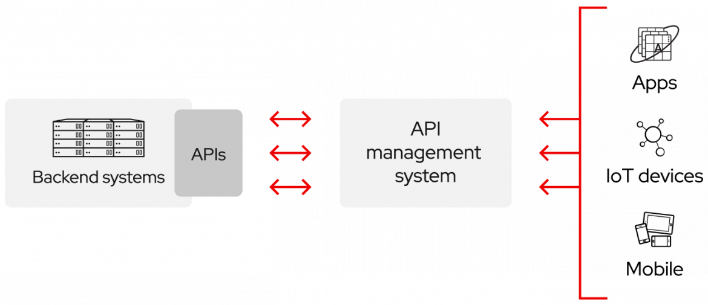

# Academia-API/Larson_Kapita_API

# Briefly about api

APIs are sometimes seen as contracts, with documentation that constitutes an agreement between the parties: if party 1 sends a request remotely according to a particular structure, party 2's software will have to respond according to the conditions defined.

Because APIs simplify the way developers integrate new application components into an existing architecture, they facilitate collaboration between IT and business teams. Business needs often change rapidly in the face of constantly evolving digital markets, where new competitors can disrupt an entire sector with a new application. To remain competitive, it is important for these businesses to support the rapid development and deployment of innovative services. Cloud-native application development is an obvious way of increasing the speed of development. It is based on connecting a microservices-type application architecture via APIs.

APIs are a simplified way of connecting your own infrastructure through cloud-native application development. They also allow you to share your data with your customers and other external users. Public APIs offer unique business value, as they can simplify and develop your relationships with your partners, and potentially monetise your data (the Google Maps API is one example).

# API environment

Private API
The API can only be used internally. This approach allows you to retain total control over the API.

Partner API
The API is shared with some of the company's partners. This approach can generate new revenue streams without compromising security.

Public APIs
The API is accessible to everyone. This approach allows third parties to develop applications that interact with your API and can become a source of innovation.

SOAP or REST
To standardise the exchange of information between the ever-increasing number of APIs, a protocol had to be developed: the Simple Object Access Protocol, better known as SOAP. APIs designed according to the SOAP protocol use the XML format for their messages and receive requests via HTTP or SMTP. SOAP aims to simplify the exchange of information between applications running in different environments or written in different languages.

API or webhook
A webhook is a callback function based on the HTTP protocol. It enables two APIs to establish lightweight, event-driven communication. While applications of all kinds use them to receive small amounts of data from other applications, webhooks can also trigger automation workflows in GitOps environments.

Webhooks are often referred to as "reverse" or "push" APIs, because they entrust the communication of data to a single application.

# Polls
```bash
Polls is a simple API allowing consumers to take part in polls and view their results.
```
## Questions Collection [/questions]

### List All Questions [GET]

```javascript
+ Response 200 (application/json)

        [
            {
                "question": "Favourite programming language?",
                "published_at": "2015-08-05T08:40:51.620Z",
                "choices": [
                    {
                        "choice": "Swift",
                        "votes": 2048
                    }, {
                        "choice": "Python",
                        "votes": 1024
                    }, {
                        "choice": "Objective-C",
                        "votes": 512
                    }, {
                        "choice": "Ruby",
                        "votes": 256
                    }
                ]
            }
        ]
```
### Create a New Question [POST]

You may create your own questions using this action. It takes a JSON
object containing a question and a collection of answers (called “choices”)

```javascript
+ Request (application/json)

        {
            "question": "Favourite programming language?",
            "choices": [
                "Swift",
                "Python",
                "Objective-C",
                "Ruby"
            ]
        }

+ Response 201 (application/json)

    + Headers

            Location: /questions/2

    + Body

            {
                "question": "Favourite programming language?",
                "published_at": "2015-08-05T08:40:51.620Z",
                "choices": [
                    {
                        "choice": "Swift",
                        "votes": 0
                    }, {
                        "choice": "Python",
                        "votes": 0
                    }, {
                        "choice": "Objective-C",
                        "votes": 0
                    }, {
                        "choice": "Ruby",
                        "votes": 0
                    }
                ]
            }
```

## RESULTS OF THE LEVEL 7 ACADEMIC TEST

your api has passed all the tests, as was shown in the assessment of the level 7 test
Thank you very much for your collaboration and your confidence in us. 
Larson-API has been selected as one of Academia's top 5 best-performing api.
It wasn't easy for you to do it in such a hurry under such extraordinary pressure.
You can see the tests passed by the great machine performance examiner 

[The examination is a special model introduced by Louis Torvald for an examination with an algorithmic character.
and machine performance in real time, the academy has adopted this method for rapid assessment
and professional](https://en.wikipedia.org/wiki/Linus_Torvalds#Life_and_career)

### All Evaluation GRAPH

   