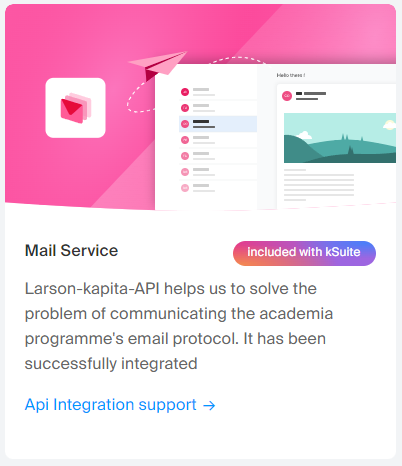
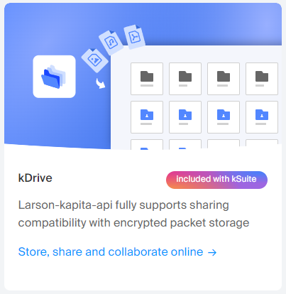
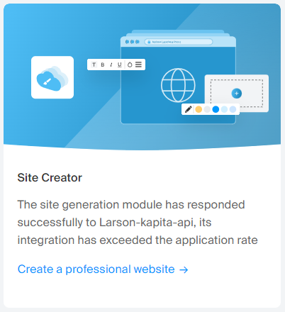
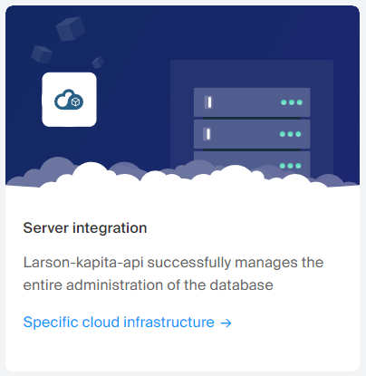
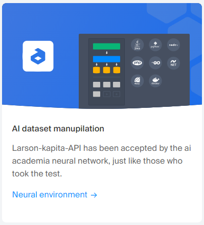

#### thank you very much for accepting the invitation we sent you 

#### all the regulations have been completed automatically in your academia file.

#### now let's take a look at the application that your api provides for the academia programme and the additional application #### functions.

### Mail service
 

### kDrive
 

### Site Creator
 

### Server Integration

### AI dataset manupilation

